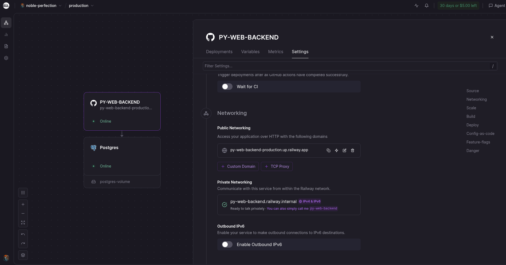
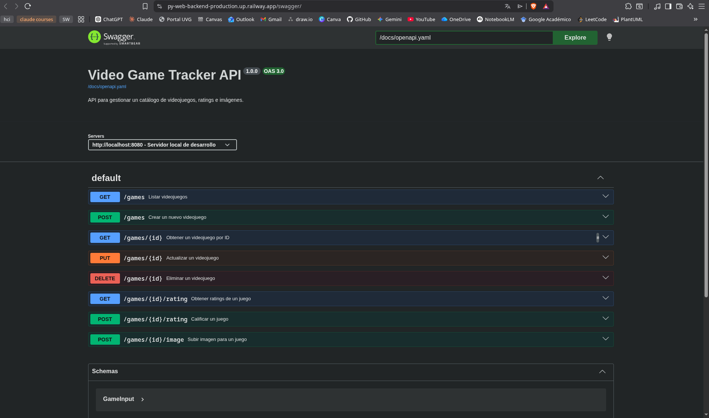

# Video Game Tracker — Backend

API REST para un catálogo de videojuegos singleplayer. Expone datos en formato JSON y no genera HTML. Construido con Go + Gin + PostgreSQL.

**Repositorio del cliente:** https://github.com/Diego-glitch-cloud/PY-WEB-CLIENT  
**Frontend en producción:** https://diego-glitch-cloud.github.io/PY-WEB-CLIENT/
**API en producción (Railway):** https://py-web-backend-production.up.railway.app

---

## Screenshots del Despliegue

### Railway (PostgreSQL + Backend)


### Swagger UI (Documentación Interactiva)


---

## Requisitos previos

- [Go 1.26+](https://go.dev/dl/)
- [Docker](https://www.docker.com/) y Docker Compose

---

## Cómo correr localmente

### 1. Clonar el repositorio

```bash
git clone https://github.com/Diego-glitch-cloud/PY-WEB-BACKEND.git
cd PY-WEB-BACKEND
```

### 2. Configurar variables de entorno

```bash
cp .env.example .env
```

Editar `.env` con las credenciales locales. El archivo `.env.example` contiene la estructura completa con los valores que deben reemplazarse.

### 3. Levantar la base de datos

```bash
docker compose up -d db adminer
```

Esto levanta:
- **PostgreSQL** en `localhost:5433` con el schema aplicado automáticamente
- **Adminer** (gestor visual de DB) en `http://localhost:8081`

Para conectarse a Adminer usar servidor `db`, usuario y contraseña del `.env`.

### 4. Poblar la base de datos (seed)

```bash
go run scripts/seed/seed.go
```

Obtiene 25 videojuegos singleplayer desde la API de RAWG.io y los inserta en la base de datos. El script es idempotente: omite juegos que ya existen.

### 5. Correr el servidor

```bash
go run main.go
```

El servidor queda disponible en `http://localhost:8080`.

---

## Endpoints de la API

### Videojuegos

| Método | Ruta | Descripción | Status |
|--------|------|-------------|--------|
| `GET` | `/games` | Listar videojuegos | 200 |
| `GET` | `/games/:id` | Obtener un videojuego | 200 / 404 |
| `POST` | `/games` | Crear videojuego | 201 |
| `PUT` | `/games/:id` | Editar videojuego | 200 / 404 |
| `DELETE` | `/games/:id` | Eliminar videojuego | 204 / 404 |

### Query parameters — `GET /games`

| Parámetro | Ejemplo | Descripción |
|-----------|---------|-------------|
| `q` | `?q=zelda` | Búsqueda por nombre (case-insensitive) |
| `sort` | `?sort=title` | Campo de ordenamiento: `title`, `release_year`, `genre`, `created_at` |
| `order` | `?order=desc` | Dirección: `asc` o `desc` |
| `page` | `?page=2` | Número de página (default: 1) |
| `limit` | `?limit=10` | Resultados por página (default: 10, máx: 100) |

### Ratings

| Método | Ruta | Descripción | Status |
|--------|------|-------------|--------|
| `POST` | `/games/:id/rating` | Crear un rating (score 1–5) | 201 |
| `GET` | `/games/:id/rating` | Obtener promedio y lista de ratings | 200 |

### Formato de respuesta exitosa (GET /games)

```json
{
  "data": [
    {
      "id": 1,
      "title": "The Witcher 3: Wild Hunt",
      "genre": "Action",
      "platform": "PC",
      "developer": "CD Projekt Red",
      "release_year": 2015,
      "description": "...",
      "image_url": "https://media.rawg.io/...",
      "avg_rating": 4.5,
      "created_at": "2026-01-01T00:00:00Z",
      "updated_at": "2026-01-01T00:00:00Z"
    }
  ],
  "page": 1,
  "limit": 10,
  "total": 25,
  "total_pages": 3
}
```

### Formato de respuesta de error

```json
{
  "error": "validation_failed",
  "message": "Key: 'GameInput.Title' Error: required",
  "field": "title"
}
```

---

## Estructura del proyecto

```
PY-WEB-BACKEND/
├── main.go                  # Punto de entrada: servidor Gin, CORS, rutas
├── go.mod / go.sum          # Módulo y dependencias de Go
├── .env.example             # Plantilla de variables de entorno
├── docker-compose.yml       # PostgreSQL + Adminer para desarrollo local
├── db/
│   ├── db.go                # Conexión a PostgreSQL
│   └── schema.sql           # Definición de tablas (aplicado automáticamente)
├── models/
│   └── game.go              # Structs: GameInput, GameResponse, Rating, ErrorResponse
├── handlers/
│   ├── games.go             # Handlers CRUD + búsqueda + paginación + ordenamiento
│   └── ratings.go           # Handlers del sistema de rating
├── scripts/
│   └── seed/
│       └── seed.go          # Script para poblar la DB desde RAWG.io
├── docs/                    # Especificación OpenAPI (pendiente)
└── uploads/                 # Imágenes subidas por usuarios
```

---

## Base de datos

El esquema está normalizado en **3FN**. Los campos `genre`, `platform` y `developer` se almacenan en tablas de lookup independientes referenciadas por clave foránea, evitando la duplicación de strings.

```
genres      (id, name)
platforms   (id, name)
developers  (id, name)
games       (id, title, genre_id→, platform_id→, developer_id→, release_year,
             description, image_url, created_at, updated_at)
ratings     (id, game_id→, score CHECK 1-5, created_at)
```

Las imágenes se almacenan como URLs de texto (`image_url TEXT`): URLs del CDN de RAWG para datos seeded, y rutas relativas `/uploads/<archivo>` para imágenes subidas manualmente.

---

## CORS

CORS, que significa "Cross-Origin Resource Sharing, es una política de seguridad del navegador que bloquea peticiones `fetch()` entre orígenes distintos a menos que el servidor lo permita explícitamente.

Configuración aplicada en este servidor:

```
Access-Control-Allow-Origin:  *
Access-Control-Allow-Methods: GET, POST, PUT, DELETE, OPTIONS
Access-Control-Allow-Headers: Content-Type
```

Implementado con `github.com/gin-contrib/cors` en `main.go`.

---

## Challenges implementados

| Challenge | Puntos |
|-----------|--------|
| Spec de OpenAPI/Swagger escrita y precisa | 20 |
| Swagger UI corriendo y servido desde el backend | 20 |
| Códigos HTTP correctos (201, 204, 404, 400) | 20 |
| Validación server-side con respuestas JSON descriptivas | 20 |
| Paginación en GET /games con `?page=` y `?limit=` | 30 |
| Búsqueda por nombre con `?q=` | 15 |
| Ordenamiento con `?sort=` y `?order=asc\|desc` | 15 |
| Sistema de rating (tabla propia, endpoints REST) | 30 |
| Subida de imágenes (Límite de 1MB implementado) | 30 |
| **Total backend** | **220** |

---

## Dependencias

| Paquete | Uso |
|---------|-----|
| `github.com/gin-gonic/gin` | Framework HTTP |
| `github.com/gin-contrib/cors` | Middleware de CORS |
| `github.com/lib/pq` | Driver PostgreSQL |
| `github.com/joho/godotenv` | Carga de variables de entorno desde `.env` |

---

## Reflexión

Trabajar con Go para construir una API REST fue una experiencia notablemente distinta a lenguajes como JavaScript o Python. La tipificación estática obliga a ser explícito con cada estructura de datos desde el inicio, lo que inicialmente parece más lento pero resulta en código más predecible. El manejo de errores mediante valores de retorno cambia la forma de pensar el flujo del programa ya que todo el tiempo se tiene que realizar programacion defensiva y atrapar los errores que puedan surgir. 

Creo que el desafio mas interesante fue hacer el script para la seed de la base de datos, ya que utiliza una api publica de juegos y mediante consultas a esa api es capaz de generar un archivo seed que luego por medio del docker compose se carga a la base de datos. Me resultó interesante y bastante más complejo de lo que imaginé inicialmente. 

PostgreSQL demostró ser considerablemente robusto, pues las constraints (`CHECK`, `FOREIGN KEY`, `UNIQUE`), los triggers para `updated_at`, y el soporte nativo para `ILIKE` en búsquedas case-insensitive son características utiles en estos contextos.

El concepto de CORS me pareció interesante, y también me resultó interesante la configuración que se realiza en el go y también en el servidor. Considero que es importante mantener esse tipo de seguridad para tener un control de las consultas externas que se realizan y las comunicaciones que pueden o no existir. 


**¿Usaría esta tecnología de nuevo?** 
Sí la usaría, pero también creo que consideraría otros lenguajes y herramientas ya que go requiere de mucha programación defensiva, proceso que se podría aligerar utilziando otro lenguaje como express. Sin embargo, el rendimiento de go es muy bueno, por lo que creo que sería ideal para proyectos que requieren alto rendimiento. 